# JavaScript

### 1.初识一些js代码

- ### **console.log()**

  > **JavaScript 的 `console.log()` 语句，它们分别会在控制台输出**

  ```JS
  console.log(`Hello`);
  console.log(`I like pizza!`);
  ```

  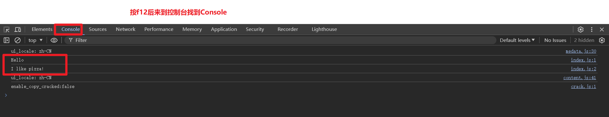

#### 1.1window.**alert()**

> **下面可以看出在vscode里的js文件写入上面代码,刷新浏览器后就会弹出一个警报窗口**

```js
window.alert(`This is an alert`);
```


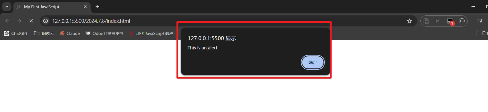

- ### window方法

  > ### 方法：
  >
  > 1. **alert()**： 弹出一个带有消息和一个确认按钮的警告框。
  >
  >    ```js
  >    window.alert("Hello, world!");
  >    ```
  >
  > 2. **confirm()**： 弹出一个带有消息、确认按钮和取消按钮的对话框，用于确认或取消操作。
  >
  >    ```js
  >    let result = window.confirm("Are you sure you want to delete this?");
  >    if (result) {
  >        // 执行删除操作
  >    } else {
  >        // 取消操作
  >    }
  >    ```
  >
  > 3. **prompt()**： 弹出一个带有消息和一个输入框的对话框，用于获取用户输入的数据。
  >
  >    ```js
  >    let username = window.prompt("Enter your username:");
  >    ```
  >
  > 4. **setTimeout()**： 在指定的延迟后执行一个函数或者一段代码。
  >
  >    ```js
  >    window.setTimeout(function() {
  >        console.log("Delayed action");
  >    }, 2000); // 2秒后执行
  >    ```
  >
  > 5. **setInterval()**： 按照指定的时间间隔重复执行一个函数或者一段代码。
  >
  >    ```js
  >    window.setInterval(function() {
  >        console.log("Repeated action");
  >    }, 1000); // 每秒执行一次
  >    ```
  >
  > 6. **open()**： 打开一个新的浏览器窗口或者新标签页。
  >
  >    ```js
  >    
  >    window.open("https://www.example.com", "_blank");
  >    ```
  >
  > 7. **close()**： 关闭当前浏览器窗口。
  >
  >    ```js
  >    window.close();
  >    ```
  >
  > ### 属性：
  >
  > 1. **document**： 表示当前窗口中载入的文档对象，可以用来访问和操作文档内容。
  >
  >    ```js
  >    let title = window.document.title;
  >    ```
  >
  > 2. **location**： 表示当前窗口的 URL 信息，可以用来获取或者修改当前页面的 URL。
  >
  >    ```js
  >    let currentUrl = window.location.href;
  >    ```
  >
  > 3. **navigator**： 包含有关浏览器的信息，例如浏览器的名称、版本和用户代理字符串。
  >
  >    ```js
  >    let browserName = window.navigator.userAgent;
  >    ```
  >
  > 4. **localStorage** 和 **sessionStorage**： 提供了在浏览器端存储数据的能力，分别用于持久化存储和会话存储。
  >
  >    ```js
  >    window.localStorage.setItem("key", "value");
  >    let storedValue = window.localStorage.getItem("key");
  >    ```
  >
  > 5. **screen**： 提供了有关用户屏幕的信息，如宽度、高度、颜色深度等。
  >
  >    ```js
  >    let screenWidth = window.screen.width;
  >    ```
  >
  > 这些方法和属性使得 JavaScript 能够与浏览器环境进行交互，实现丰富的用户体验和功能。

- ### **document.getElementById.textContent ();**

- **html**

  ```html
    <body>
      <h1 id="myH1"></h1>
      <p id="myp"></p>
      <!-- 在body中链接js文件 -->
      <script src="index.js"></script>
    </body>
  ```

  

- **js**

  > **document: 这是JavaScript中代表当前HTML文档的对象,通过`document`对象，可以访问和操作整个HTML页面的内容**

  

  

  > **getElementById: 这是document对象的一个方法，用于通过指定的id属性获取文档中的一个元素。在这里getElementById: 这是document对象的一个方法，用于通过指定的id属性获取文档中的一个元素。在这里`getElementById("myH1")`表示要获取id为"myH1"的元素**

  

  > **.textContent: 这是获取元素文本内容的属性。一旦我们使用`getElementById`方法获取到了id为"myp"的元素，`.textContent`可以访问和修改该元素的文本内容。**

  ```js
  document.getElementById("myH1").textContent = `Hello`;
  document.getElementById("myp").textContent = `I like pizza!`;
  ```

### 2.变量

- ### 模板字符${}

  > **在这个例子中，模板字符串 ``my are ${age} years old`` 中的 `${age}` 部分会被变量 `age` 的值替换，而整个字符串会被打印到控制台上**

  ```js
  let age;	// 先声明一个变量age
  age = 18;	// 给age赋值为18
  
  console.log(`my are ${age} years old`);		// 在控制台终端看到 my are 18 years old
  ```

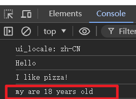

- ### **typeof **

  > 

  ```js
  let age = 18;	// 先声明一个变量age,再直接赋值
  
  let firstName = "Ah Nan" 	//再声明一个变量firstName.然后直接赋值
  
  let z = true;
  
  let x;		//未定义的变量
  console.log(typeof x); // 输出 "undefined"
  console.log(typeof z); // 输出 "boolean"
  //这四个再终端显示都加了typeof
  console.log(typeof age);	//输出 "number"	
  console.log(typeof firstName);	//输出 "string"
  ```

  

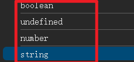

### 3.算术运算符

> **以下算术运算符跟其他语言的用法都差不多一致: 所以不做多演示笔记**

**在JavaScript中，常见的算术运算符包括：**

1. **加法：+**
2. **减法：-**
3. **乘法：***
4. **除法：/**
5. **取余：%**
6. **指数运算：****

**此外，还有一些增强赋值运算符，例如：**

- **加法赋值：+=**
- **减法赋值：-=**
- **乘法赋值：*=**
- **除法赋值：/=**
- **取余赋值：%=**

#### ++操作符

- ### 前缀形式

  > **在前缀形式中，`++` 操作符先递增变量的值，然后返回递增后的值。**

  - ```js
    let x = 5;
    let y = ++x;
    console.log(x); // 输出 6
    console.log(y); // 输出 6
    // 前缀形式：先将 y 增加 1（变为 6），然后返回 y 的值（6）。
    ```

- ### 后缀形式

  > **在后缀形式中，`++` 操作符先返回变量的当前值，然后再递增变量的值。**

  - ```js
    let x = 5;
    let y = x++;
    console.log(x); // 输出 6
    console.log(y); // 输出 5
    // 后缀形式：先返回 x 的值（5），然后将 x 增加 1，所以此时 x 变为 6。
    ```

    

  

#### - -操作符

- ### 前缀形式

> **当 `--` 放在变量前面时，称为前缀形式。它的作用是先减少变量的值，然后返回减少后的值。**

- ```js
  let x = 5;
  let y = --x;
  // 现在 x 的值是 4, y 的值也是 4
  ```

  

- ### 后缀形式

> **当 `--` 放在变量后面时，称为后缀形式。它的作用是先返回变量的当前值，然后再减少变量的值。**

- ```js
  let x = 5;
  let y = x--;
  // 现在 x 的值是 4, y 的值是 5
  ```

#### 算数运算符的优先级: 重要-由高到低

> 1. **括号** `()`：括号可以用来改变运算符的优先级或者明确表达式的执行顺序。
> 2. **一元运算符**（单目运算符）：包括递增 `++`、递减 `--`、取反 `!`、负号 `-` 等。
> 3. **乘法运算符**：`*`（乘法）、`/`（除法）、`%`（取模）。
> 4. **加法运算符**：`+`（加法）、`-`（减法）。
> 5. **关系运算符**：`<`、`>`、`<=`、`>=`。
> 6. **相等运算符**：`==`、`!=`、`===`、`!==`。
> 7. **逻辑与运算符**：`&&`。
> 8. **逻辑或运算符**：`||`。
> 9. **条件运算符**（三元运算符）：`? :`。
> 10. **赋值运算符**：`=`, `+=`, `-=` 等等

### 4.接收用户输入(交互)

- **html**

```html
  <body>
    <h1 id="myH1"></h1>
    <p id="myp"></p>
    <!-- 在body中链接js文件 -->
    <script src="index2.js"></script>
  </body>
```

- **js**

  > prompt()： 弹出一个带有消息和一个输入框的对话框，用于获取用户输入的数据

```js
// 先声明一个变量 username;
let username;

username = window.prompt("What's your username?");

console.log(username);

```

- **效果图**

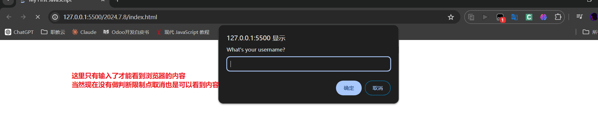

> **终端能看到输入了什么**

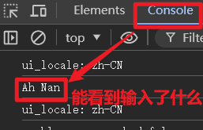

#### 小例子

- **html**

```html
<!DOCTYPE html>
<html lang="en">
  <head>
    <meta charset="UTF-8" />
    <meta name="viewport" content="width=device-width, initial-scale=1.0" />
    <title>My website</title>
    <link rel="stylesheet" href="index.css" />
  </head>
  <body>
    <h1 id="myH1">Welcome</h1>

    <label> username: </label>
    <input id="MyText" /> <br /><br />
    <button id="MySubmit">submit</button>
    <script src="index.js"></script>
  </body>
</html>

```

- **js**

```js
//设定点击按钮判断
let username; //声明一个username变量

document.getElementById("MySubmit").onclick = function () {
  username = document.getElementById("MyText").value;
  document.getElementById("myH1").textContent = `Hello ${username}`;
};

```

- **js代码解释**

  > ### 解释：
  >
  > 1. **事件绑定**：
  >    - `document.getElementById("MySubmit")` 用于获取 ID 为 `"MySubmit"` 的元素，通常这是一个按钮元素或者提交按钮。
  > 2. **点击事件处理函数**：
  >    - `.onclick = function () { ... }` 将一个匿名函数赋值给按钮的点击事件处理函数。当按钮被点击时，这个函数内的代码将会被执行。
  > 3. **获取输入值**：
  >    - `username = document.getElementById("MyText").value;` 获取 ID 为 `"MyText"` 的输入框的值，并将其赋值给变量 `username`。
  > 4. **更新元素内容**：
  >    - `document.getElementById("myH1").textContent = `Hello ${username}`;` 将 ID 为 `"myH1"` 的元素的 `textContent` 属性设置为 `"Hello ${username}"`。这通常用于动态更新页面上的文本内容。

- **js代码里的username = document.getElementById("MyText").value**

  > **.value**
  >
  > 用于获取或设置 HTML 元素的值。具体来说，在以下代码片段中：
  >
  > ```js
  > username = document.getElementById("MyText").value;
  > ```
  >
  > 这行代码的作用是从具有 `id` 为 `"MyText"` 的 HTML 元素中获取其当前的值，并将这个值赋给变量 `username`。
  >
  > ### 解释：
  >
  > - **`document.getElementById("MyText")`**：这部分代码使用了 `document.getElementById()` 方法来获取文档中具有 `id` 属性为 `"MyText"` 的元素。假设这是一个 `<input>` 或者 `<textarea>` 元素。
  >
  > - **`.value`**：这是 HTML 元素对象的一个属性，用来获取用户输入的值。对于 `<input>` 元素来说，它代表输入框中的文本内容；对于 `<textarea>` 元素来说，它代表文本区域中的文本内容
  >
  >   
  >
  > - 当用户在输入框中输入 `"Ah Nan"` 并点击提交按钮时，`username = document.getElementById("MyText").value;` 这行代码将会将 `"Ah Nan"` 赋值给 `username` 变量。
  >
  > - 然后，`document.getElementById("myH1").textContent = `Hello ${username}`;` 这行代码将会将 `"Hello Ah Nan"` 设置为 `<h1>` 元素的文本内容，因此在页面上会显示 `"Hello John"`。
  >
  > 因此，`.value` 在这里的作用是用来获取 `<input>` 或者 `<textarea>` 元素中用户输入的文本内容\

  - **效果图**

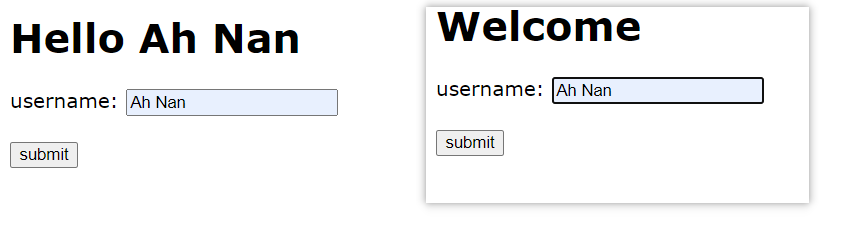

### 5.类型转换

> 例如: 将数据类型转换成另一种类型
>
> **初始化变量**：
>
> ```js
> let x = "pizza";
> let y = "pizza";
> let z = "pizza";
> let d = "0";
> ```
>
> 这里声明了三个变量 `x`、`y`、`z`，它们的初始值都是字符串 `"pizza"`。
>
> **类型转换**：
>
> - `x = Number(x);`：将 `x` 的值从字符串 `"pizza"` 转换为数值。由于 `"pizza"` 无法直接转换为数值，转换后的结果将是 `NaN`（Not a Number）。
>
> - `y = String(y);`：虽然 `y` 已经是字符串，但是这里的操作实际上不会改变 `y` 的值，依然是 `"pizza"`。
>
> - `z = Boolean(z);`：将 `z` 的值从字符串 `"pizza"` 转换为布尔值。在 JavaScript 中，任何非空字符串转换为布尔值都是 `true`，因此 `z` 的值变为 `true`。
>
> - `d = Boolean(d);`: 将d的值转换成为布尔值,在JavaScript 中,除了一些特殊的情况（如空字符串 `""`、`null`、`undefined`、`NaN`、`0` 等），所有字符串都会被转换为 `true`。
>
> - `d = Boolean(d);` 的操作：
>
>   - `d` 最初被赋值为 `"0"`（一个非空的字符串）。
>   - 调用 `Boolean(d)` 将字符串 `"0"` 转换为布尔值。因为 `"0"` 不是空字符串，根据上述规则，它会被转换为 `true`。
>   - 所以，执行完 `d = Boolean(d);` 后，变量 `d` 的值将变为 `true`。
>
>   因此，`d = Boolean(d);` 并没有冲突，它正确地将字符串 `"0"` 转换为布尔值 `true`。
>
> **输出结果**：
>
> ```js
> console.log(x, typeof x); // 输出: NaN "number"
> console.log(y, typeof y); // 输出: pizza "string"
> console.log(z, typeof z); // 输出: true "boolean"
> ```
>
> - `console.log(x, typeof x);`：输出 `x` 的值 `NaN` 和它的类型 `"number"`。因为 `"pizza"` 无法转换为有效的数值，所以 `Number("pizza")` 返回 `NaN`。
> - `console.log(y, typeof y);`：输出 `y` 的值 `"pizza"` 和它的类型 `"string"`。虽然进行了 `String(y)` 的操作，但是字符串的类型没有改变。
> - `console.log(z, typeof z);`：输出 `z` 的值 `true` 和它的类型 `"boolean"`。因为 `"pizza"` 转换为布尔值是 `true`

- **NaN: Not a Number的简写**

  > **NaN**：
  >
  > - `NaN` 是 JavaScript 中的一个特殊值，表示 "Not a Number"，即不是一个有效的数值。它通常作为某些数学运算的结果，当运算无法产生有效的数值时会返回 `NaN`。

  - **效果图**

  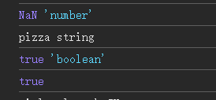

### 6.常量

- ### const: 是一个无法修改的变量,一旦设置他就无法更改

  > **例如: 一个计算Π的计算程序**

  - **可以被修改  :**

    ```js
    let pi = 3.1415926; // 可修改的圆周率值
    let radius;		// 用于用户输入圆的半径
    let cirumference;  // 计算出的圆的周长
    
    pi = 444 //一旦圆周率被修改了,而且还不知道的情况下,计算就不准确了
    
    radius = window.prompt(`Enter the radius of a circle`);  // 提示用户输入圆的半径
    radius = Number(radius); 	// 将用户输入的半径值从字符串转换为数字类型
    
    cirumference = 2 * pi *radius;	// 计算圆的周长公式
    
    console.log(cirumfernce); 	// 在控制台打印计算出的周长结果
    ```

    - **效果图**

    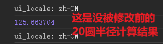

    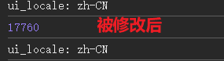

  - **不可被修改 :**

    > **在JavaScript中，使用 `const` 声明的变量是常量，一旦赋值之后就不能再修改其值。**

    ```js
    const PI = 3.1415926; // 不可被修改的圆周率值
    let radius;		// 用于用户输入圆的半径
    let cirumference;  // 计算出的圆的周长
    
    PI = 444 // 报错constante.js:18 Uncaught TypeError: Assignment to constant variable.
    
    
    radius = window.prompt(`Enter the radius of a circle`);  // 提示用户输入圆的半径
    radius = Number(radius); 	// 将用户输入的半径值从字符串转换为数字类型
    
    cirumference = 2 * PI *radius;	// 计算圆的周长公式
    
    console.log(cirumfernce); 	// 在控制台打印计算出的周长结果
    ```

    - **效果图**

    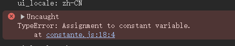

#### 小例子

- **html**

  ```html
  <!DOCTYPE html>
  <html lang="en">
    <head>
      <meta charset="UTF-8" />
      <meta name="viewport" content="width=device-width, initial-scale=1.0" />
      <title>constante</title>
      <link rel="stylesheet" href="style.css" />
    </head>
    <body>
      <h1 id="myH1">Enter the radius of a circle</h1>
      <label>radius:</label>
      <input type="text" id="myText" />
      <button id="mySubmit">submit</button>
      <h3 id="myH3"></h3>
      <script src="constante.js"></script>
    </body>
  </html>
  
  ```

- **js**

  ```js
  // 小例子用const
  const PI = 3.1415926; // 定义一个常量 PI，表示圆周率的近似值
  
  let radius; // 声明一个变量 radius，用于存储用户输入的圆的半径
  let circumference; // 声明一个变量 circumference，用于存储计算得到的圆的周长
  
  // 给 id 为 "mySubmit" 的按钮添加点击事件监听器
  document.getElementById("mySubmit").onclick = function () {
    // 获取用户在 id 为 "myText" 的输入框中输入的值，并将其存储到变量 radius 中
    radius = document.getElementById("myText").value;
    
    // 将 radius 转换为数值类型，因为从输入框获取的值是字符串类型
    radius = Number(radius);
    
    // 计算圆的周长，公式为 2 * PI * radius
    circumference = 2 * PI * radius;
    
    // 将计算得到的周长值显示在页面上 id 为 "myH3" 的元素中
    document.getElementById("myH3").textContent = `El radio de este círculo es: ${circumference} cm`;
  };
  ```

  - **效果图**

  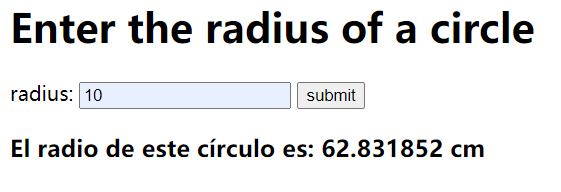

### 7.用js和html做一个计数程序

#### **CounterProgram**

**html**

```html
<!DOCTYPE html>
<html lang="en">
  <head>
    <meta charset="UTF-8" />
    <meta name="viewport" content="width=device-width, initial-scale=1.0" />
    <title>CounterProgram</title>
    <link rel="stylesheet" href="Style.css" />
    <!-- 引入外部样式表 -->
  </head>
  <body>
    <label id="counstLabel">0</label><br />
    <!-- 显示计数器值的标签 -->
    <div id="btnContainer">
      <button id="decreaseBtn" class="buttons">减少</button>
      <!-- 减少按钮 -->
      <button id="resetBtn" class="buttons">重置</button>
      <!-- 重置按钮 -->
      <button id="increasesBtn" class="buttons">增加</button>
      <!-- 增加按钮 -->
    </div>
    <script src="CounterProgram.JS"></script>
    <!-- 引入外部 JavaScript 文件 -->
  </body>
</html>

```

**js**

```js
// 获取页面中的按钮和标签元素
const decreaseBtn = document.getElementById("decreaseBtn"); // 减少按钮
const resetBtn = document.getElementById("resetBtn"); // 重置按钮
const increasesBtn = document.getElementById("increasesBtn"); // 增加按钮
const counstLabel = document.getElementById("counstLabel"); // 显示计数的标签

let count = 0; // 初始化计数器变量，初始值为0

// 增加按钮的点击事件处理函数
increasesBtn.onclick = function () {
  count++; // 每点击一次增加按钮，计数器加1
  counstLabel.textContent = count; // 更新页面上显示计数的标签内容
};

// 减少按钮的点击事件处理函数
decreaseBtn.onclick = function () {
  count--; // 每点击一次减少按钮，计数器减1
  counstLabel.textContent = count; // 更新页面上显示计数的标签内容
};

// 重置按钮的点击事件处理函数
resetBtn.onclick = function () {
  count = 0; // 将计数器重置为0
  counstLabel.textContent = count; // 更新页面上显示计数的标签内容
};

```

**css**

```css
#counstLabel {
  display: block; /* 显示为块级元素 */
  text-align: center; /* 文本居中对齐 */
  font-size: 10em; /* 字体大小 */
  font-family: Helvetica; /* 字体样式 */
}

#btnContainer {
  text-align: center; /* 按钮容器文本居中对齐 */
}

.buttons {
  padding: 10px 20px; /* 左右填充10px，上下填充20px */
  font-size: 1.5em; /* 字体大小 */
  color: white; /* 字体颜色 */
  background-color: #7ab5fd; /* 背景颜色 */
  border-radius: 5px; /* 边框圆角 */
  cursor: pointer; /* 鼠标指针样式为手型 */
  transition: background-color 0.25s; /* 背景颜色变化动画 */
}

.buttons:hover {
  background-color: #4292fc; /* 鼠标悬停时的背景颜色 */
}
```

#### 效果图

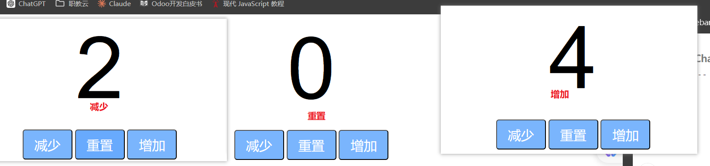

### 8.JavaScript中内置的 `Math` 对象

- **`Math` 对象提供了许多数学函数和常量，可以用于执行各种数学运算**

> ### 常用方法和属性
>
> 1. **常量**
>    - `Math.PI`: 圆周率 π 的值，约为 3.14159。
>    - `Math.E`: 自然对数的底 e 的值，约为 2.718。
> 2. **基本数学运算**
>    - `Math.abs(x)`: 返回 x 的绝对值。
>    - `Math.sqrt(x)`: 返回 x 的平方根。
>    - `Math.pow(x, y)`: 返回 x 的 y 次幂。
>    - `Math.exp(x)`: 返回 e 的 x 次幂。
>    - `Math.log(x)`: 返回 x 的自然对数。
>    - `Math.log10(x)`: 返回 x 的以 10 为底的对数。
>    - `Math.floor(x)`: 返回小于或等于 x 的最大整数。
>    - `Math.ceil(x)`: 返回大于或等于 x 的最小整数。
>    - `Math.round(x)`: 返回 x 的四舍五入值。
> 3. **三角函数**
>    - `Math.sin(x)`, `Math.cos(x)`, `Math.tan(x)`: 分别返回 x 的正弦、余弦和正切值。
>    - `Math.asin(x)`, `Math.acos(x)`, `Math.atan(x)`: 分别返回 x 的反正弦、反余弦和反正切值。
> 4. **随机数**
>    - `Math.random()`: 返回一个介于 0（包括）到 1（不包括）之间的随机数。
> 5. **其他**
>    - `Math.min(x1, x2, ..., xn)`: 返回参数列表中的最小值。
>    - `Math.max(x1, x2, ..., xn)`: 返回参数列表中的最大值。
>
> ### 示例
>
> ```js
> // 计算圆的面积
> function circleArea(radius) {
>     return Math.PI * Math.pow(radius, 2);
> }
> 
> // 计算角度的正弦值和余弦值
> function trigonometry(angle) {
>     var radians = angle * Math.PI / 180; // 将角度转换为弧度
>     var sinValue = Math.sin(radians);
>     var cosValue = Math.cos(radians);
>     return { sin: sinValue, cos: cosValue };
> }
> 
> // 生成一个介于 min 和 max 之间的随机整数
> function getRandomInt(min, max) {
>     min = Math.ceil(min);
>     max = Math.floor(max);
>     return Math.floor(Math.random() * (max - min)) + min;
> }
> 
> // 使用示例
> console.log(circleArea(5)); // 输出: 78.53981633974483
> console.log(trigonometry(30)); // 输出: { sin: 0.5, cos: 0.8660254037844387 }
> console.log(getRandomInt(1, 10)); // 输出: 介于 1 和 10 之间的随机整数
> ```
>
> ### 注意事项
>
> - `Math` 对象中的方法和属性是静态的，直接通过 `Math.method()` 的方式调用，不需要创建 `Math` 对象的实例。
> - 在进行浮点数计算时，由于 JavaScript 使用双精度浮点数表示（IEEE 754 标准），可能会存在精度问题，需要注意处理。

### 9.随机生成数

- **随机生成**

  > ### 1. 生成介于0（包含）到1（不包含）之间的随机数
  >
  > 使用 `Math.random()` 函数：
  >
  > ```js
  > let randomNum = Math.random();
  > console.log(randomNum);
  > ```
  >
  > `Math.random()` 生成一个介于0（包含）和1（不包含）之间的随机浮点数。
  >
  > ### 2. 生成介于0（包含）到指定最大值 `max`（不包含）之间的随机整数
  >
  > 可以通过将 `Math.random()` 生成的浮点数乘以 `max`，然后使用 `Math.floor()` 进行取整：
  >
  > ```js
  > const max = 100;
  > let randomNum = Math.floor(Math.random() * max);
  > console.log(randomNum);
  > ```
  >
  > 这将生成一个介于0（包含）和 `max`（不包含）之间的随机整数。
  >
  > ### 3. 生成介于 `min`（包含）到 `max`（不包含）之间的随机整数
  >
  > 通过将 `Math.random()` 生成的浮点数乘以 `(max - min)`，然后加上 `min`，再使用 `Math.floor()` 进行取整：
  >
  > ```js
  > const min = 50;
  > const max = 100;
  > let randomNum = Math.floor(Math.random() * (max - min)) + min;
  > console.log(randomNum);
  > ```
  >
  > 这将生成一个介于 `min`（包含）和 `max`（不包含）之间的随机整数。
  >
  > ### 4. 生成介于 `min`（包含）到 `max`（包含）之间的随机整数
  >
  > 通过在上述方法的基础上，将乘法中的范围调整为 `(max - min + 1)`：
  >
  > ```js
  > const min = 50;
  > const max = 100;
  > let randomNum = Math.floor(Math.random() * (max - min + 1)) + min;
  > console.log(randomNum);
  > ```
  >
  > 这将生成一个介于 `min`（包含）和 `max`（包含）之间的随机整数。
  >
  > ### 5. 生成介于0（包含）到1（包含）之间的随机浮点数
  >
  > 通过将 `Math.random()` 生成的浮点数稍作调整：
  >
  > ```js
  > let randomNum = Math.random();
  > console.log(randomNum);
  > ```
  >
  > `Math.random()` 生成的浮点数本身就介于0（包含）和1（不包含）之间，如果需要生成介于0（包含）到1（包含）之间的浮点数，可以将结果稍作处理，例如：
  >
  > ```js
  > let randomNum = Math.min(Math.random() + Number.EPSILON, 1);
  > console.log(randomNum);
  > ```
  >
  > 这样可以确保结果不会等于1但非常接近1。
  >
  > ### 总结
  >
  > JavaScript提供了 `Math.random()` 函数，用于生成介于0（包含）到1（不包含）之间的随机浮点数。通过对该浮点数进行缩放和位移，可以生成各种范围内的随机数。使用 `Math.floor()` 或 `Math.ceil()` 可以将浮点数转换为整数，满足不同的随机数生成需求。


- **示例**

  > ```js
  > const min = 50;
  > const max = 100;
  > 
  > let randomNum = Math.floor(Math.random() * (max - min + 1)) + min;
  > 
  > console.log(randomNum);
  > ```
  >
  > 1. **常量声明：**
  >
  >    ```js
  >    const min = 50;
  >    const max = 100;
  >    ```
  >
  >    这里声明了两个常量 `min` 和 `max`，并分别初始化为50和100。这两个常量定义了随机数生成的范围。
  >
  > 2. **生成随机数：**
  >
  >    ```js
  >    let randomNum = Math.floor(Math.random() * (max - min + 1)) + min;
  >    ```
  >
  >    这一行代码生成一个介于50到100之间的随机整数。具体步骤如下：
  >
  >    - `Math.random()`: 生成一个介于0（包含）到1（不包含）之间的随机浮点数。
  >    - `Math.random() * (max - min + 1)`: 将随机浮点数放大到0到51（不包含）之间，因为 `(max - min + 1)` 等于51。
  >    - `Math.floor(Math.random() * (max - min + 1))`: 将随机浮点数向下取整，得到一个介于0到50（包含0但不包含51）的整数。
  >    - `Math.floor(Math.random() * (max - min + 1)) + min`: 将这个整数加上 `min`（即50），最终结果是一个介于50到100（包含50和100）之间的整数。
  >
  > 3. **输出结果：**
  >
  >    ```js
  >    console.log(randomNum);
  >    ```
  >
  >    这一行代码将生成的随机数输出到控制台。
  >
  > 通过这种方式，你可以生成一个介于50到100之间的随机整数。

#### 小例子

- **html**

  ```html
  <!DOCTYPE html>
  <html lang="en">
    <head>
      <meta charset="UTF-8" />
      <meta name="viewport" content="width=device-width, initial-scale=1.0" />
      <title>RandomNumberGenerator</title>
      <!-- 引入外部的CSS样式表 -->
      <link rel="stylesheet" href="Style.css" />
    </head>
    <body>
      <!-- 按钮，用于触发随机数生成 -->
      <button id="myButton">roll</button><br />
      <!-- 标签，用于显示第一个随机数 -->
      <label id="label1" class="myLabels"></label><br />
      <!-- 标签，用于显示第二个随机数 -->
      <label id="label2" class="myLabels"></label><br />
      <!-- 标签，用于显示第三个随机数 -->
      <label id="label3" class="myLabels"></label><br />
      <!-- 引入外部的JavaScript文件 -->
      <script src="RandomNumberGenerator.JS"></script>
    </body>
  </html>
  
  ```

  

- **js**

  ```js
  // 获取按钮和标签元素
  const myButton = document.getElementById("myButton");
  const label1 = document.getElementById("label1");
  const label2 = document.getElementById("label2");
  const label3 = document.getElementById("label3");
  
  // 定义随机数的最小值和最大值
  const min = 1;
  const max = 6;
  
  let randomNum1;
  let randomNum2;
  let randomNum3;
  
  // 按钮点击事件，生成随机数并显示在标签上
  myButton.onclick = function () {
    randomNum1 = Math.floor(Math.random() * max) + min;
    randomNum2 = Math.floor(Math.random() * max) + min;
    randomNum3 = Math.floor(Math.random() * max) + min;
    label1.textContent = randomNum1;
    label2.textContent = randomNum2;
    label3.textContent = randomNum3;
  };
  
  ```

  

- **css**

  ```css
  /* 设置body的字体和文本对齐方式 */
  body {
    font-family: Verdana;
    text-align: center;
  }
  
  /* 设置按钮的字体大小、内边距和边框圆角 */
  #myButton {
    font-size: 3em;
    padding: 5px 25px;
    border-radius: 5px;
  }
  
  /* 设置标签的字体大小 */
  .myLabels {
    font-size: 3em;
  }
  
  ```

  #### 效果图

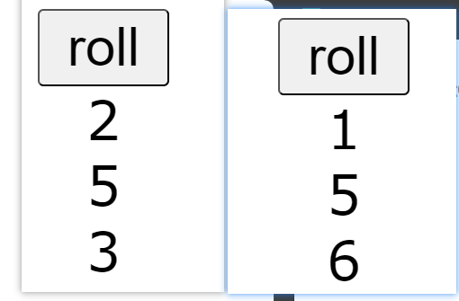